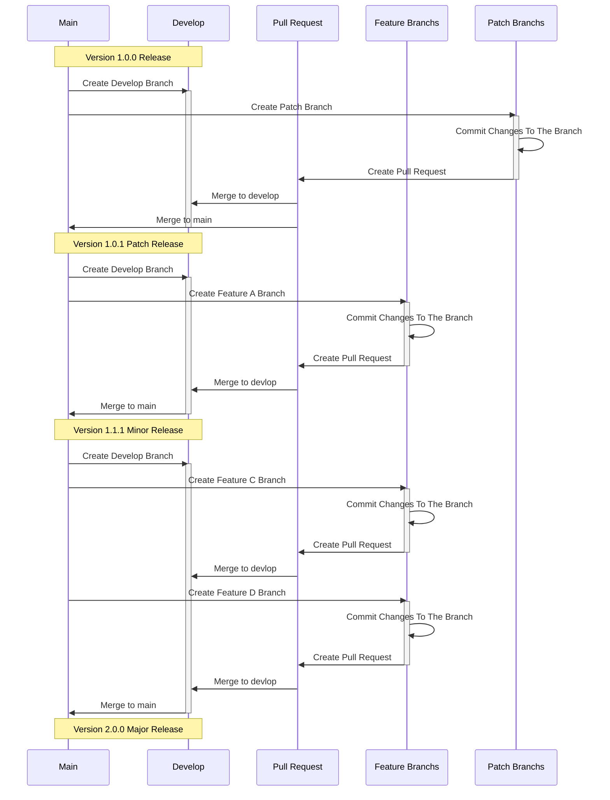

# Technical Design Document (TDD): P9G Member/Prepaid Package Module
**Version:** 1.0  
**Project:** P9G  
**Author:** [Your Name/Team Name]  
**Date:** 26/08/2025  
**Status:** Draft  

## 1. Overview
This document details the technical design and implementation specifics for the new Prepaid Package Management Module, as specified in the PRD-0001. The goal is to create a system that allows for the sale and tracking of 90-day prepaid packages, decoupled from individual member records, to support usage by multiple end-customers.

## 2. Architecture & Dependencies
*   **Project Type:** Module within an existing Web Application (Presumably a Node.js/Express or similar stack based on context).
*   **Frontend:** Existing frontend framework. New components will be created.
*   **Backend:** Existing REST API layer. New endpoints will be added.
*   **Database:** New tables will be created and will be updated existing.
*   **Dependencies:** This module will interact with the existing `members` and `reservations` tables.

## 3. Database Schema Design

### 3.1 New Table: `prepaid_packages`
This table stores the core package information.

| Field Name | Type | Constraints | Default | Description |
| :--- | :--- | :--- | :--- | :--- |
| `id` | CHAR(36) | PRIMARY KEY, NOT NULL | `UUID()` | **Prepaid ID** (PK) |
| `customer_id` | CHAR(36) | FOREIGN KEY, NOT NULL | | Links to the `members.id` who purchased the package. |
| `purchase_date` | DATETIME | NOT NULL | `CURRENT_TIMESTAMP` | |
| `start_date` | DATE | NOT NULL | `CURDATE()` | |
| `end_date` | DATE | NOT NULL | | Calculated as `start_date + INTERVAL days DAY`. |
| `days` | INT | NOT NULL, UNSIGNED | 90 | Total days in the package. |
| `usage` | INT | NOT NULL, UNSIGNED | 0 | Sum of days consumed. |
| `remaining` | INT | NOT NULL, UNSIGNED | 90 | **Virtual Field:** `days - usage`. **(See Implementation Note)** |
| `amount` | DECIMAL(10, 2) | NOT NULL | 0 | Purchase price. |
| `currency` | CHAR(3) | NOT NULL | 'KWR' | ISO currency code. |
| `payment_mode` | VARCHAR(20) | NOT NULL | 'Cash' | e.g., Cash, BankTransfer, CreditCard. |
| `created_at` | TIMESTAMP | NOT NULL | `CURRENT_TIMESTAMP` | |
| `updated_at` | TIMESTAMP | NOT NULL | `CURRENT_TIMESTAMP ON UPDATE CURRENT_TIMESTAMP` | |

**Indexes:**
*   `idx_prepaid_customer_id` (`customer_id`)
*   `idx_prepaid_end_date` (`end_date`)
*   `idx_prepaid_remaining` (`remaining`) (If `remaining` is stored)

### 3.2 Modification to Existing Table: `reservations`
A new column is added to link a reservation to a prepaid package.

| Field Name | Type | Constraints | Default | Description |
| :--- | :--- | :--- | :--- | :--- |
| `prepaid_id` | CHAR(36) | FOREIGN KEY, NULLABLE | `NULL` | Links to `prepaid_packages.id`. |

**Indexes:**
*   `idx_reservation_prepaid_id` (`prepaid_id`)

### 3.3 Entity-Relationship Diagram (ERD)
+-------------------+ +----------------------+ +----------------+
| members | | prepaid_packages | | reservations |
+-------------------+ +----------------------+ +----------------+
| id (PK) |<--+ | id (PK) | | id (PK) |
| name | | | customer_id (FK) |--+ | ... |
| ... | | | purchase_date | | | prepaid_id (FK)|--+
| | | | days | | | ... | |
+-------------------+ | | usage | | +----------------+ |
| | ... | | |
| +----------------------+ | |
+----------------------------+----------------------+
*   **One-to-Many:** One `member` (acting as a purchaser) can buy many `prepaid_packages`.
*   **One-to-Many:** One `prepaid_package` can be used for many `reservations`.
*   **Many-to-One:** One `reservation` uses one `prepaid_package` (optional).

## 4. API Endpoint Specifications

### 4.1 Prepaid Packages Collection Endpoint
*   **GET** `/api/v1/prepaid-packages`
    *   **Description:** Retrieves a paginated list of prepaid packages. Supports filtering via query parameters (e.g., `?customer_id=UUID&remaining_gt=0`).
    *   **Response:** `200 OK`
        ```json
        {
          "data": [
            {
              "id": "a1b2c3d4...",
              "customer_id": "e5f6g7h8...",
              "days": 90,
              "usage": 15,
              "remaining": 75,
              "end_date": "2025-11-20",
              "status": "Active" // Calculated field
            }
          ],
          "pagination": {...}
        }
        ```

*   **POST** `/api/v1/prepaid-packages`
    *   **Description:** Creates a new prepaid package.
    *   **Request Body:**
        ```json
        {
          "customer_id": "e5f6g7h8...", // REQUIRED
          "start_date": "2025-08-26",    // OPTIONAL, defaults to today
          "days": 90,                    // OPTIONAL, defaults to 90
          "amount": 900000.00,
          "currency": "KWR",
          "payment_mode": "BankTransfer"
        }
        ```
    *   **Response:** `201 Created` (with full object) or `400 Bad Request` (validation errors).

### 4.2 Prepaid Package Instance Endpoint
*   **GET** `/api/v1/prepaid-packages/{id}`
    *   **Description:** Gets a single package by its ID.
    *   **Response:** `200 OK` (with full object) or `404 Not Found`.

*   **PUT** `/api/v1/prepaid-packages/{id}`
    *   **Description:** Updates a package's editable fields (e.g., `start_date` before usage begins).
    *   **Response:** `200 OK` (with updated object) or `400 Bad Request`.

*   **DELETE** `/api/v1/prepaid-packages/{id}`
    *   **Description:** Soft-deletes a package if it has no usage. **NOT IMPLEMENTED IN V1.**

### 4.3 Reservation Endpoint Modification
*   **POST** `/api/v1/reservations`
*   **PUT** `/api/v1/reservations/{id}`
    *   **Request Body:** Must now accept a `prepaid_id` field.
    *   **Validation:** The API must check the business rules (sufficient days, valid package) before saving. Deduction logic happens on check-in, not on reservation creation.

## 5. Business Logic & Algorithms

### 5.1 Package Status Calculation
A computed property `status` will be determined as follows:
```javascript
// Pseudocode
function getStatus(package) {
  const today = new Date();
  if (package.remaining <= 0) return "Exhausted";
  if (today > package.end_date) return "Expired";
  return "Active";
}
```

### 5.2 Usage Deduction Process
This is the most critical function. It will be triggered by the check-in operation.
```
// Pseudocode for Deduction Service
async function deductUsage(reservationId) {
  1.  Fetch the reservation and its linked prepaid package.
  2.  Calculate `nights = (checkout_date - checkin_date)`.
  3.  Check if `package.remaining >= nights`.
      - If false: Throw an error "Insufficient days".
  4.  Start a database transaction.
  5.  Update the package: `package.usage += nights`.
      - (If `remaining` is a stored column: `package.remaining = package.days - package.usage`)
  6.  Commit the transaction.
  7.  Log the deduction event.
}
```
Important: This logic must be atomic and thread-safe to prevent race conditions if two check-ins happen simultaneously on the same package. Use database transactions (BEGIN TRANSACTION ... COMMIT) and row-level locking (SELECT ... FOR UPDATE in SQL).

## 6. Frontend Component Design
New Component: PrepaidPackageList.vue (or .jsx): Displays the table of packages. Mirrors the Member List page.

New Component: PrepaidPackageForm.vue: A modal/dialog for creating/editing packages.

Modification: ReservationForm.vue: Add a new form field "Prepaid ID". This should be a searchable dropdown that fetches active packages for the selected customer.

## 7. Non-Functional Considerations
Performance: All database queries on prepaid_packages must use indexes to meet the <1s response time requirement.

Security:

API endpoints must be protected by authentication middleware.

Input validation must be performed on both frontend and backend to prevent XSS and SQL injection (use parameterized queries).

Data Integrity: The usage field must be kept in sync with the sum of reservation nights. The deduction process is the single source of truth for updating it.

## 8. Open Issues & Risks
Risk: The deduction logic is a critical path process. Failure could lead to financial loss. Requires thorough testing.

Question: How should packages be handled if a reservation is edited (e.g., dates changed) or canceled? (V1 Scope: Not handled. Requires future story.)

Question: Should there be an admin-level override for the deduction rules? (e.g., manual adjustment of usage).

## 9. Test Strategy
Unit Tests:

Service layer functions (e.g., deductUsage, getStatus) must have >90% coverage.

Test all business rules: successful deduction, insufficient days error, package status calculation.

Integration Tests:

Test full API endpoints: Create, Read, Update of packages.

Test the reservation creation flow with a valid and invalid prepaid_id.

Test the check-in process and verify the usage field is updated correctly in the database.

Edge Cases to Test:

Attempting to use an expired package.

Attempting to use a package with exactly the required remaining days.

Concurrent check-in attempts on the same package (to test transaction locking).

## 10. Deployment & Migration Plan
Database Migration:

A migration script will be written to:

Create the prepaid_packages table.

Add the prepaid_id column to the reservations table.

Create all necessary indexes and foreign key constraints.

Backend Deployment:

New API endpoints and modified reservation service will be deployed.

Frontend Deployment:

New UI components will be deployed behind a feature flag to allow for testing by admins before full release.

Data Migration:

N/A for V1. Existing member-day data will not be migrated. The new system starts fresh.

## 11. Monitoring & Logging
Logging: All critical actions (package creation, usage deduction, insufficient balance errors) must be logged to a centralized logging service.

Monitoring: Key metrics to monitor:

API endpoint latency for /prepaid-packages and /reservations.

Error rates for the deduction process.

Database query performance for the new tables.

## 12. Success Criteria
All User Stories from the PRD are implemented and pass QA acceptance.

The usage deduction process is reliable and handles concurrency without data corruption.

The new module meets the specified performance requirements (<5s page load, <1s popup load).

The deployment is completed with zero downtime for the existing application.

## 13. Appendix
SQL for Table Creation:
```
-- 1. Create the new prepaid_packages table
CREATE TABLE `prepaid_packages` (
  `id` char(36) NOT NULL DEFAULT (UUID()),
  `customer_id` char(36) NOT NULL,
  `purchase_date` datetime NOT NULL DEFAULT CURRENT_TIMESTAMP,
  `start_date` date NOT NULL DEFAULT (CURDATE()),
  `end_date` date NOT NULL,
  `days` int unsigned NOT NULL DEFAULT '90',
  `usage` int unsigned NOT NULL DEFAULT '0',
  `amount` decimal(10,2) NOT NULL DEFAULT '0.00',
  `currency` char(3) NOT NULL DEFAULT 'KWR',
  `payment_mode` varchar(20) NOT NULL DEFAULT 'Cash',
  `created_at` timestamp NOT NULL DEFAULT CURRENT_TIMESTAMP,
  `updated_at` timestamp NOT NULL DEFAULT CURRENT_TIMESTAMP ON UPDATE CURRENT_TIMESTAMP,
  PRIMARY KEY (`id`),
  KEY `idx_prepaid_customer_id` (`customer_id`),
  KEY `idx_prepaid_end_date` (`end_date`),
  CONSTRAINT `fk_prepaid_customer` FOREIGN KEY (`customer_id`) REFERENCES `members` (`id`) ON DELETE RESTRICT
) ENGINE=InnoDB DEFAULT CHARSET=utf8mb4 COLLATE=utf8mb4_0900_ai_ci;

-- 2. Add the prepaid_id column to the reservations table
ALTER TABLE `reservations`
ADD COLUMN `prepaid_id` char(36) DEFAULT NULL,
ADD KEY `idx_reservation_prepaid_id` (`prepaid_id`);

-- 3. Add foreign key constraint to link to the new table
ALTER TABLE `reservations`
ADD CONSTRAINT `fk_reservation_prepaid` FOREIGN KEY (`prepaid_id`) REFERENCES `prepaid_packages` (`id`) ON DELETE SET NULL;

```
### 13.2 Sample API Payloads
Request: Create a new Prepaid Package
POST /api/v1/prepaid-packages
```
{
  "customer_id": "a1b2c3d4-e5f6-7890-abcd-ef1234567890",
  "start_date": "2025-09-01",
  "days": 90,
  "amount": 450000.00,
  "currency": "KWR",
  "payment_mode": "BankTransfer"
}
```
Response: Success
201 Created
```
{
  "data": {
    "id": "z9y8x7w6-v5u4-3210-ijkl-mn9876543210",
    "customer_id": "a1b2c3d4-e5f6-7890-abcd-ef1234567890",
    "purchase_date": "2025-08-26T14:30:00.000Z",
    "start_date": "2025-09-01",
    "end_date": "2025-11-30",
    "days": 90,
    "usage": 0,
    "remaining": 90,
    "amount": 450000.00,
    "currency": "KWR",
    "payment_mode": "BankTransfer",
    "status": "Active"
  }
}
```
Request: Create a Reservation using a Prepaid ID
POST /api/v1/reservations
```
{
  "guest_name": "John Doe",
  "checkin_date": "2025-09-15",
  "checkout_date": "2025-09-20",
  "prepaid_id": "z9y8x7w6-v5u4-3210-ijkl-mn9876543210",
  "...": "other reservation fields"
}
```
### 13.3 Sequence Diagram: Usage Deduction Process
The following sequence diagram illustrates the critical flow of deducting days from a package during check-in.



### 13.4 Glossary of Terms
Prepaid ID (Package ID): The unique identifier (UUID) for a purchased package. This is the core token that is shared and used for reservations.

Purchaser (customer_id): The member who bought the package. This could be an individual or an agent.

End User: The guest who actually stays in the room; they are linked to the package via the reservation, not directly to the package itself.

Usage Deduction: The atomic process of subtracting nights from a package's remaining balance, triggered at check-in.

Business Rules Engine: The server-side logic (described in Section 5) that enforces the constraints of package usage.